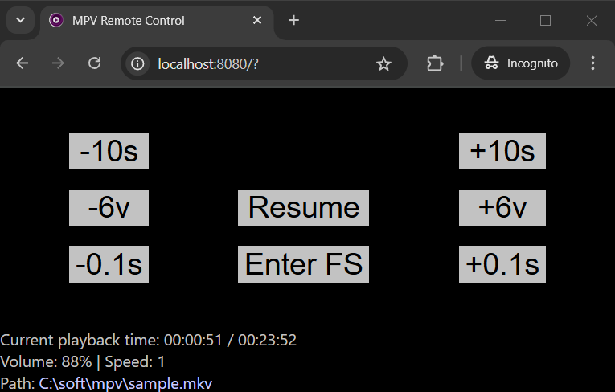

# mpv Remote Control

Browser-based remote control application for [mpv](https://mpv.io/) for Windows.



## Features

- Resume, pause
- Volume control
- Speed control
- Seek
- Open files from PC

## Build requirements

- [Go 1.24.1](https://go.dev/dl/)

## Usage

1. Compile executable:

```powershell
.\make.ps1 build-release
```

2. Use `mpvrc.exe` to open media files. It will launch HTTP server for remote control and `mpv`:

```powershell
.\mpvrc.exe video.mp4
```

3. Navigate to `http://localhost:8080` to open remote control application. Replace `localhost` with internal network IP address to open UI from other device in the same network

4. Close `mpv` window to terminate remote control application
